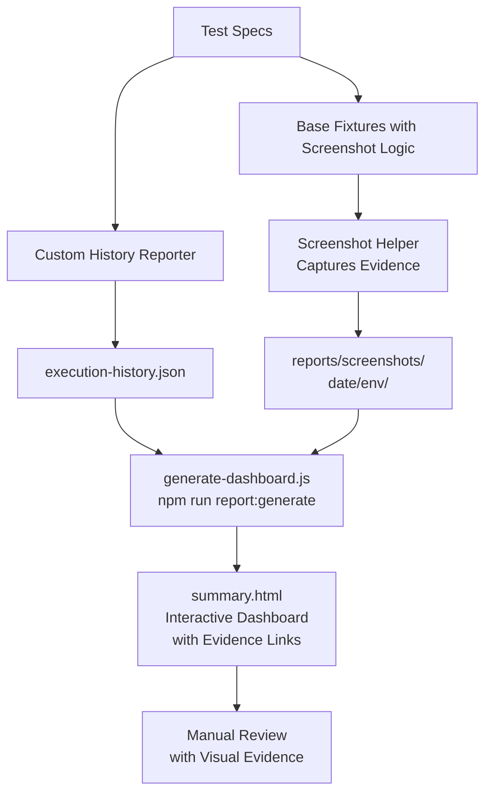

# Playwright Performance Tracking & Evidence Collection Plan

## Overview

This plan implements a comprehensive performance tracking system that:
- **Captures historical test execution data** (test name, status, duration, timestamp)
- **Persists data** to `execution-history.json` using a custom Playwright reporter
- **Generates interactive dashboards** with Pass/Fail trends and performance comparisons
- **Collects visual evidence** (screenshots) for every test run
- **Embeds evidence** directly in the HTML dashboard for complete traceability

---

## Architecture



---

## Project Structure

```
practice-automation/
├── package.json                           # Enhanced with 'report:generate' script
├── playwright.config.ts                   # Updated with custom reporter
├── execution-history.json                 # GENERATED - persistent results storage
├── src/
│   ├── fixtures/
│   │   └── base.fixture.ts                # ENHANCED - add screenshot capture hook
│   ├── pages/                             # Existing page objects
│   ├── components/                        # Existing components
│   ├── helpers/
│   │   ├── data.helper.ts                 # Existing
│   │   └── screenshot.helper.ts           # NEW - screenshot capture utility
│   ├── models/                            # NEW - TypeScript interfaces
│   │   └── test-result.model.ts           # TestResult, ExecutionRecord interfaces
│   └── reporters/                         # NEW - custom reporters
│       └── history.reporter.ts            # Custom Reporter for persistence
├── scripts/
│   ├── run-staging.js                     # Existing
│   ├── generate-dashboard.js              # NEW - parse history & generate dashboard
│   └── dashboard-template.html            # NEW - HTML template with D3.js
├── reports/
│   ├── html/                              # Existing - standard Playwright reports
│   ├── screenshots/                       # NEW - organized evidence storage
│   │   ├── 2026-02-20/
│   │   │   ├── local/
│   │   │   │   ├── login_1708950000_pass.png
│   │   │   │   ├── login_1708950002_fail.png
│   │   │   │   └── ...
│   │   │   ├── staging/
│   │   │   └── ci/
│   │   └── summary.html                   # GENERATED - interactive dashboard
│   └── execution-history.json             # GENERATED - historical data
└── tests/                                 # Existing test specs
```

---

## Detailed Implementation Steps

### Phase 1: Data Model & Custom Reporter

#### 1.1 Create Test Result Model (`src/models/test-result.model.ts`)

**Interfaces:**
- `TestResult`: Individual test file scan
  - `testName: string`
  - `status: 'passed' | 'failed' | 'skipped'`
  - `duration: number` (milliseconds)
  - `timestamp: string` (ISO 8601)
  - `retries: number`
  - `projectName: string` (chromium/firefox/webkit)
  - `environment: string` (local/staging/ci)

- `ExecutionRecord`: Single test run collection
  - `executionId: string` (UUID)
  - `startTime: string`
  - `endTime: string`
  - `totalDuration: number`
  - `results: TestResult[]`
  - `summary: { passed: number; failed: number; skipped: number; total: number }`

- `HistoryData`: Full history file
  - `executions: ExecutionRecord[]`
  - `lastUpdated: string`
  - `totalRuns: number`

#### 1.2 Create Custom Reporter (`src/reporters/history.reporter.ts`)

**Implementation:**
- Extends Playwright's `Reporter` base class
- Implements `onEnd(result: FullResult)` hook
- Parses `result.suites` to extract test metadata
- Appends results to `execution-history.json` (create if not exists)
- Captures:
  - Test name from test spec
  - Pass/fail status
  - Duration in milliseconds
  - ISO 8601 timestamp
  - Retry count
  - Project name (browser)
  - Environment from `process.env.TEST_ENV`

**Key Methods:**
```typescript
- formatTestName(suiteName: string, testName: string): string
- getTestStatus(test: TestResult): 'passed' | 'failed' | 'skipped'
- loadExistingHistory(): HistoryData
- saveHistory(data: HistoryData): void
- appendExecution(results: ExecutionRecord): void
```

---

### Phase 2: Screenshot Evidence Collection

#### 2.1 Create Screenshot Helper (`src/helpers/screenshot.helper.ts`)

**Implementation:**
- Utility class for capturing screenshots
- Naming convention: `[testName]_[timestamp]_[status].png`
  - Example: `login_valid_credentials_1708950000123_pass.png`
- Creates organized directory structure: `reports/screenshots/[YYYY-MM-DD]/[environment]/`
- Returns relative path for evidence embedding in reports

**Key Methods:**
```typescript
- captureScreenshot(
    page: Page, 
    testName: string, 
    status: 'pass' | 'fail' | 'skip',
    environment: string
  ): Promise<string>             // returns relative path
- getScreenshotPath(
    environment: string,
    testName: string,
    timestamp: number,
    status: string
  ): string
- ensureDirectoryExists(dirPath: string): void
- cleanOldScreenshots(daysToKeep: number): void
```

#### 2.2 Enhance Base Fixture (`src/fixtures/base.fixture.ts`)

**Changes:**
- Add `afterEach` hook in fixture setup
- Capture screenshot on test completion (both pass and fail)
- Attach screenshot path to test context for later embedding
- Integrate with screenshot helper

**Implementation:**
```typescript
test.afterEach(async ({ page }, testInfo) => {
  const screenshotPath = await captureScreenshot(
    page,
    testInfo.title,
    testInfo.status,
    process.env.TEST_ENV || 'local'
  );
  // Store in test.info for dashboard embedding
  testInfo.attach('screenshot-path', {
    body: screenshotPath,
    contentType: 'text/plain'
  });
});
```

---

### Phase 3: Playwright Configuration

#### 3.1 Update `playwright.config.ts`

**Changes:**
- Register custom history reporter in `reporter` array
- Add configuration for screenshot capture directory
- Ensure test naming includes suite names for clarity

```typescript
reporter: [
  ['html', { outputFolder: 'reports/html' }],
  ['list'],
  ['./src/reporters/history.reporter.ts'],  // ← NEW
],
```

---

### Phase 4: Dashboard Generation

#### 4.1 Create Dashboard Generator Script (`scripts/generate-dashboard.js`)

**Input:**
- Reads `execution-history.json`
- Scans `reports/screenshots/` directory structure
- Parses screenshot metadata

**Processing:**
- Aggregate historical data for trends
- Calculate Pass/Fail rates over time
- Determine Parallel vs Sequential performance:
  - **Sequential**: Sum of test durations
  - **Parallel**: Max duration of concurrent batch
- Group results by date, environment, and test name
- Map screenshot paths to test results

**Output:**
- Generates `reports/summary.html` with:
  - Embedded D3.js charts
  - Interactive visualizations
  - Complete screenshot evidence links/embedded images
  - Performance metrics table

#### 4.2 Create Dashboard HTML Template (`scripts/dashboard-template.html`)

**Features:**
- **Pass/Fail Trend Chart** (Line chart)
  - X-axis: Execution dates
  - Y-axis: Count of passes/failures
  - Color coding: Green for pass, red for fail
  
- **Environment Performance** (Bar chart)
  - Compare pass rates across local/staging/ci
  
- **Parallel vs Sequential Comparison** (Column chart)
  - Show time savings from parallelization
  - X-axis: Test run
  - Y-axis: Duration (ms)
  - Grouped bars: Sequential vs Actual (Parallel)

- **Test Evidence Gallery**
  - Collapsible sections per test
  - Thumbnail previews of screenshots
  - Links to full-size or embedded base64 images
  - Click to expand and review evidence

- **Execution Log Table**
  - Sortable columns: Test, Status, Duration, Timestamp, Environment
  - Filter by status, environment, date range
  - Direct access to associated screenshots

**Technology Stack:**
- **D3.js** v7+ for charts (via CDN)
- **Bootstrap 5** for responsive layout (via CDN)
- **Pure JavaScript** for interactivity (no build step)
- **CSS** for styling and animations

---

### Phase 5: Evidence Embedding

#### 5.1 Enhance Dashboard Script for Evidence Integration

**Two Approaches (Select One or Both):**

**Option A: Base64 Embedding (All-in-One File)**
- Convert PNG screenshots to base64
- Embed directly in HTML ``
- Advantage: Single standalone HTML file, no external dependencies
- Disadvantage: Larger file size for many screenshots

**Option B: Path Linking with Static Hosting**
- Store relative paths in JSON data
- Generate ``
- Advantage: Smaller HTML file, better caching
- Disadvantage: Requires screenshots/ directory alongside HTML

**Recommended: Hybrid Approach**
- Embed thumbnails as base64 (small, low-quality for gallery)
- Link full-size images for detailed review
- Include toggle between embedded and linked viewing

---

## Phase 6: Package.json Scripts

**Add to `package.json`:**
```json
{
  "scripts": {
    "test": "playwright test",
    "test:headed": "playwright test --headed",
    "test:staging": "node scripts/run-staging.js",
    "test:ui": "playwright test --ui",
    "report": "playwright show-report reports/html",
    "report:generate": "node scripts/generate-dashboard.js",
    "report:view": "npm run report:generate && start reports/summary.html"
  }
}
```

---

## Data Persistence Strategy

### execution-history.json Structure

```json
{
  "executions": [
    {
      "executionId": "exec-1708950000-abc123",
      "startTime": "2026-02-20T10:00:00Z",
      "endTime": "2026-02-20T10:05:45Z",
      "totalDuration": 345000,
      "environment": "local",
      "results": [
        {
          "testName": "Login > successful login with valid credentials",
          "status": "passed",
          "duration": 2500,
          "timestamp": "2026-02-20T10:00:15Z",
          "retries": 0,
          "projectName": "chromium",
          "screenshotPath": "screenshots/2026-02-20/local/login-valid_1708950015123_pass.png"
        },
        {
          "testName": "Login > invalid username shows error",
          "status": "failed",
          "duration": 1800,
          "timestamp": "2026-02-20T10:00:17Z",
          "retries": 1,
          "projectName": "chromium",
          "screenshotPath": "screenshots/2026-02-20/local/login-invalid-username_1708950017456_fail.png"
        }
      ],
      "summary": {
        "passed": 8,
        "failed": 2,
        "skipped": 0,
        "total": 10
      }
    }
  ],
  "lastUpdated": "2026-02-20T10:05:45Z",
  "totalRuns": 42
}
```

---

## Dashboard Visualization Examples

### 1. Pass/Fail Trend Over Time
- **Chart Type**: Line Chart
- **Data**: Last 30 days of execution data
- **Display**: Two lines (Pass count and Fail count)
- **Interaction**: Tooltip on hover, click legend to toggle series

### 2. Parallel vs Sequential Performance
- **Chart Type**: Grouped Column Chart
- **Data**: Last 10 runs
- **Display**: 
  - Sequential duration (sum of all test durations)
  - Actual parallel duration (max of concurrent batch)
  - Time saved indicator
- **Formula**: 
  - Sequential time: Σ(all test durations)
  - Parallel time: max(batch durations)
  - Savings: Sequential - Parallel (with percentage)

### 3. Test Evidence Gallery
- **Display**: Collapsible sections per test case
- **Content**: 
  - Test name and description
  - All historical runs (pass/fail)
  - Screenshot thumbnail grid with timestamps
  - Click thumbnail to expand full image
  - Metadata: Duration, timestamp, environment, retry count

### 4. Execution Summary Table
- **Columns**: Test Name | Status | Duration | Timestamp | Environment | Screenshot Link
- **Features**:
  - Sortable columns
  - Filterable by status/environment/date
  - Color-coded status badges
  - Direct access to evidence

---

## Testing & Validation Checklist

- [ ] Custom reporter creates `execution-history.json` after first test run
- [ ] Screenshot helper creates organized directories by date/environment
- [ ] At least 1 screenshot captured per test (pass or fail)
- [ ] Dashboard script runs without errors: `npm run report:generate`
- [ ] `reports/summary.html` displays with all interactive features
- [ ] Pass/Fail trend chart shows multiple data points
- [ ] Parallel vs Sequential comparison is accurate
- [ ] Evidence gallery shows thumbnails and links/embeds correctly
- [ ] Dashboard is responsive on mobile (Bootstrap)
- [ ] Running tests multiple times appends to history (not overwrites)
- [ ] Environment filtering works correctly in dashboard
- [ ] Screenshots can be deleted manually without breaking dashboard link logic

---

## Success Criteria

**Core Requirements:**
1. ✅ Custom reporter captures and persists test results to JSON
2. ✅ `npm run report:generate` creates working HTML dashboard
3. ✅ Dashboard visualizes Pass/Fail trends over time
4. ✅ Dashboard shows Parallel vs Sequential performance comparison
5. ✅ Screenshots automatically captured for all 10+ test cases
6. ✅ Screenshot evidence accessible from dashboard

**Bonus Features:**
- 🎁 Evidence embedded directly in HTML (base64 or path)
- 🎁 Interactive charts with D3.js
- 🎁 Filterable execution log
- 🎁 Environment-based performance comparison
- 🎁 Screenshot gallery with thumbnails and metadata

---

## Implementation Order

**Recommended sequence** (dependencies first):

1. Create `src/models/test-result.model.ts` (no dependencies)
2. Create `src/helpers/screenshot.helper.ts` (import models)
3. Create `src/reporters/history.reporter.ts` (import models)
4. Update `src/fixtures/base.fixture.ts` (import screenshot helper)
5. Update `playwright.config.ts` (reference custom reporter)
6. Create `scripts/dashboard-template.html` (standalone HTML, no code)
7. Create `scripts/generate-dashboard.js` (import models, uses template)
8. Update `package.json` with new scripts
9. Run tests and validate JSON generation
10. Run `npm run report:generate` and validate HTML output
11. Refine dashboard styling and features based on test data

---

## Deliverables Summary

| Deliverable | Type | Purpose |
|---|---|---|
| `test-result.model.ts` | TypeScript | Define data structures |
| `history.reporter.ts` | Custom Reporter | Capture results to JSON |
| `screenshot.helper.ts` | Utility | Organize screenshot evidence |
| `base.fixture.ts` (updated) | Fixture | Auto-capture screenshots |
| `playwright.config.ts` (updated) | Config | Register custom reporter |
| `execution-history.json` | Data file | Persistent test results |
| `screenshots/` (generated) | Evidence | Organized screenshots |
| `generate-dashboard.js` | Script | Parse history, generate HTML |
| `dashboard-template.html` | Template | Dashboard HTML structure |
| `summary.html` (generated) | Report | Interactive dashboard |
| `package.json` (updated) | Config | npm scripts |

---

## Notes & Assumptions

- **Isolation**: Each execution gets unique `executionId` (UUID + timestamp)
- **Cleanup**: Optionally auto-clean old screenshots (configurable days)
- **Performance**: Dashboard generation is fast (<1s for 100 runs)
- **Storage**: Screenshots stored locally; easily exportable to cloud storage
- **Compatibility**: Works with all Playwright browsers (chromium, firefox, webkit)
- **Multi-environment**: Tracks local, staging, and CI results separately
- **CSV Alternative**: JSON chosen for easier querying; CSV export available as future enhancement
