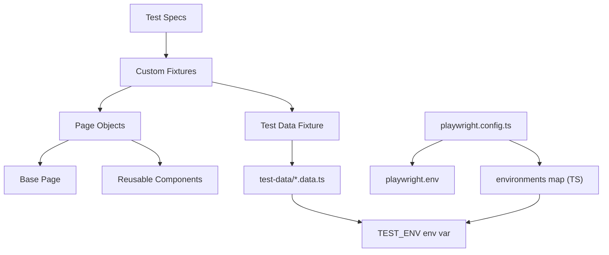
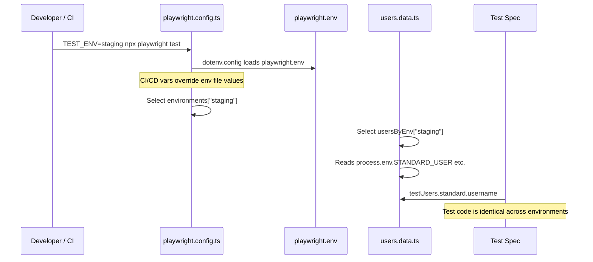

# Playwright Framework with Multi-Environment Support and Environment-Agnostic Test Data

## Architecture




The key insight from the previous conversation: **only infrastructure config (URLs, timeouts, retries) is environment-specific. Test data uses role-based abstractions (e.g. `users.standard`, `users.locked`) that resolve to environment-specific values behind the scenes, so tests themselves never hardcode environment-dependent data.**

## Project Structure

```
playwright-demo/
├── package.json
├── tsconfig.json
├── playwright.config.ts           # environments map + dotenv loading
├── playwright.env                 # local defaults (gitignored) 
├── playwright.env.example         # committed template showing required vars
├── .gitignore
├── README.md
├── src/
│   ├── fixtures/
│   │   └── base.fixture.ts        # custom fixtures: page objects + test data
│   ├── pages/
│   │   ├── base.page.ts           # abstract base page
│   │   ├── login.page.ts          # login page object
│   │   └── logged-in-success.page.ts  # post-login success page object
│   ├── components/
│   │   └── navbar.component.ts    # reusable header/nav (Log out link)
│   ├── helpers/
│   │   ├── api.helper.ts          # API setup/teardown utility
│   │   └── data.helper.ts         # generic data loading utility
│   └── test-data/
│       └── users.data.ts          # user credentials keyed by environment
├── tests/
│   ├── login.spec.ts              # login tests
│   └── logged-in.spec.ts          # post-login success page tests
└── reports/                       # generated (gitignored)
```

## Step-by-Step Implementation

### 1. Initialize project and install dependencies

- `npm init -y`
- `npm init playwright@latest -- --yes --quiet --lang=TypeScript`
- `npm install -D dotenv`
- Remove auto-generated example tests

### 2. Create `playwright.env` + `playwright.env.example`

Target application: [Practice Test Automation](https://practicetestautomation.com/). Login page: `/practice-test-login/`.

`playwright.env` (gitignored -- local defaults):

```
BASE_URL=https://practicetestautomation.com
STANDARD_USER=student
STANDARD_PASSWORD=Password123
INVALID_USER=incorrectUser
INVALID_PASSWORD=incorrectPassword
```

`playwright.env.example` (committed -- shows required vars without values):

```
BASE_URL=
STANDARD_USER=
STANDARD_PASSWORD=
INVALID_USER=
INVALID_PASSWORD=
```

This follows the convention where credentials for non-local environments come from CI/CD pipeline variables, not from files.

### 3. Configure `playwright.config.ts` with inline environments map

Following the ul-cronos pattern found in the codebase:

```typescript
import { defineConfig } from '@playwright/test';
import dotenv from 'dotenv';
import path from 'path';

dotenv.config({ path: './playwright.env' });

const environment = process.env.TEST_ENV || 'local';

const environments = {
  local: {
    baseURL: process.env.BASE_URL || 'https://practicetestautomation.com',
    timeout: 30_000,
    workers: undefined,   // auto
    retries: 0,
  },
  ci: {
    baseURL: process.env.BASE_URL || 'https://practicetestautomation.com',
    timeout: 45_000,
    workers: 2,
    retries: 2,
  },
  staging: {
    baseURL: process.env.BASE_URL!,
    timeout: 60_000,
    workers: 2,
    retries: 1,
  },
};

const envConfig = environments[environment as keyof typeof environments]
  || environments.local;

export default defineConfig({
  testDir: './tests',
  timeout: envConfig.timeout,
  retries: envConfig.retries,
  workers: envConfig.workers,
  use: { baseURL: envConfig.baseURL, /* ... */ },
  // reporters, projects (chromium, firefox, webkit), etc.
});
```

No separate `src/config/env.config.ts` module -- the config is co-located where Playwright expects it.

### 4. Create environment-agnostic test data (`src/test-data/users.data.ts`)

Practice Test Automation credentials: valid user `student`/`Password123`; invalid username `incorrectUser`; invalid password `incorrectPassword`. Test data is keyed by environment but accessed through **role-based abstractions** — tests reference `users.valid` or `users.invalidUsername`, never hardcoded strings:

```typescript
type UserCredentials = { username: string; password: string };
type UserRoles = {
  valid: UserCredentials;
  invalidUsername: UserCredentials;  // wrong username → "Your username is invalid!"
  invalidPassword: UserCredentials;  // wrong password → "Your password is invalid!"
};

const usersByEnv: Record<string, UserRoles> = {
  local: {
    valid:           { username: 'student', password: 'Password123' },
    invalidUsername: { username: 'incorrectUser', password: 'Password123' },
    invalidPassword: { username: 'student', password: 'incorrectPassword' },
  },
  ci: {
    valid:           { username: 'student', password: 'Password123' },
    invalidUsername: { username: 'incorrectUser', password: 'Password123' },
    invalidPassword: { username: 'student', password: 'incorrectPassword' },
  },
  staging: {
    valid: {
      username: process.env.STANDARD_USER!,
      password: process.env.STANDARD_PASSWORD!,
    },
    invalidUsername: {
      username: process.env.INVALID_USER!,
      password: process.env.STANDARD_PASSWORD!,
    },
    invalidPassword: {
      username: process.env.STANDARD_USER!,
      password: process.env.INVALID_PASSWORD!,
    },
  },
};

const env = process.env.TEST_ENV || 'local';
export const users: UserRoles = usersByEnv[env] ?? usersByEnv.local;
```

For staging/prod, credentials are injected via CI/CD pipeline variables. The test code is identical regardless of environment.

### 5. Build base page object (`src/pages/base.page.ts`)

Abstract class with common Playwright `Page` wrappers: `navigate(path)`, `waitForPageLoad()`, `clickElement(locator)`, `fillInput(locator, value)`, `getText(locator)`, `isVisible(locator)`.

### 6. Build concrete page objects

- `login.page.ts` — locators for username/password/submit/error; `login(user, pass)` and `getErrorMessage()` methods. Login page URL: `/practice-test-login/`
- `logged-in-success.page.ts` — locators for success message ("Congratulations student. You successfully logged in!"), Log out link; methods like `getSuccessMessage()`, `clickLogout()`

### 7. Build reusable component (`src/components/navbar.component.ts`)

Encapsulates Log out link and any shared header/nav elements — composable into page objects (the logged-in-success page uses a simple Log out link).

### 8. Build custom fixtures (`src/fixtures/base.fixture.ts`)

Extend Playwright's `test` to inject page objects **and** test data:

```typescript
export const test = base.extend<{
  loginPage: LoginPage;
  loggedInSuccessPage: LoggedInSuccessPage;
  testUsers: UserRoles;
}>({
  loginPage: async ({ page }, use) => { await use(new LoginPage(page)); },
  loggedInSuccessPage: async ({ page }, use) => { await use(new LoggedInSuccessPage(page)); },
  testUsers: async ({}, use) => { await use(users); },
});
```

Tests consume `testUsers.valid.username` — never a hardcoded string.

### 9. Write test suites

`**tests/login.spec.ts**`:

- Successful login with `testUsers.valid` → redirects to `/logged-in-successfully/`
- Error message with `testUsers.invalidUsername` → "Your username is invalid!"
- Error message with `testUsers.invalidPassword` → "Your password is invalid!"
- Error on empty credentials

`**tests/logged-in.spec.ts**`:

- Success page shows expected text after login ("Congratulations student. You successfully logged in!")
- Log out link is displayed and returns to login page

All tests import `test` and `expect` from `src/fixtures/base.fixture.ts`.

### 10. Add npm scripts, `.gitignore`, `README.md`

npm scripts: `test`, `test:headed`, `test:chrome`, `test:debug`, `test:ui`, `test:staging`, `report`

The `test:staging` script: `TEST_ENV=staging npx playwright test`

`.gitignore`: `node_modules/`, `reports/`, `test-results/`, `playwright-report/`, `playwright.env`, `blob-report/`

### 11. Validate selectors via Playwright MCP

Use browser tools to navigate to [practicetestautomation.com](https://practicetestautomation.com) (login at `/practice-test-login/`, success at `/logged-in-successfully/`), take snapshots, and confirm locators used in page objects are correct.

## How Environment Switching Works




- **Local**: `npx playwright test` (defaults to `local`, reads `playwright.env`)
- **CI**: Pipeline sets `TEST_ENV=ci` + any override env vars
- **Staging**: Pipeline sets `TEST_ENV=staging` + `STANDARD_USER` + `STANDARD_PASSWORD` etc.

## Key Design Decisions

- **Inline environments map (not separate config module)**: Co-located in `playwright.config.ts` per ul-cronos pattern; no extra module to import
- **Role-based test data abstractions**: Tests reference `users.standard`, never `"Bob"` or `"Alice"` -- environment-agnostic by design
- **Secrets via CI/CD pipeline vars**: No `.env.staging` or `.env.prod` files; pipelines inject credentials at runtime
- **MSPA-aligned data philosophy**: Test data is organized by scenario/role, not by environment; only URLs change per environment

---

## Target Application: Practice Test Automation

| Item | Value |
|------|-------|
| Base URL | https://practicetestautomation.com |
| Login page | /practice-test-login/ |
| Success page | /logged-in-successfully/ |
| Valid user | student / Password123 |
| Invalid username | incorrectUser → "Your username is invalid!" |
| Invalid password | incorrectPassword → "Your password is invalid!" |

**Optional extension**: Add `table.page.ts` and `table.spec.ts` for [Practice Test Table](https://practicetestautomation.com/practice-test-table/) (filters, sort, reset) to expand test coverage.